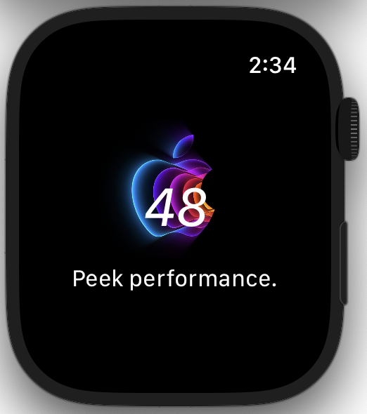
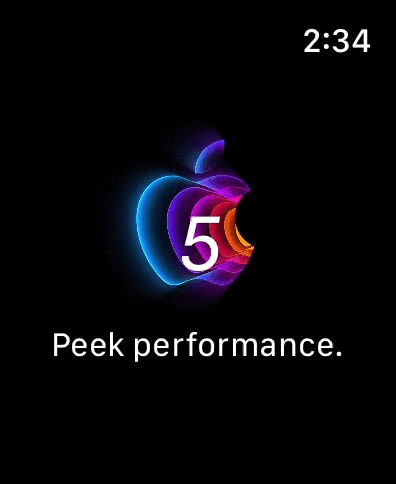

# AppleEventTracker
## WatchOS Application to track Apple Event
  On D-Day, it shows the QR Code to watch Apple Event!
 Developed by Peter Wi.

## Screenshots

|Name|Screenshots|Key Points
|--|--|--|
|[AppleEventTracker]||1.MVVM Pattern 2.Core Data 3.Face ID/TouchID/Passcode 4.Animation 5.Search Bar 6.Zoom In/Out
